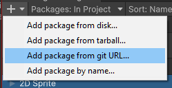
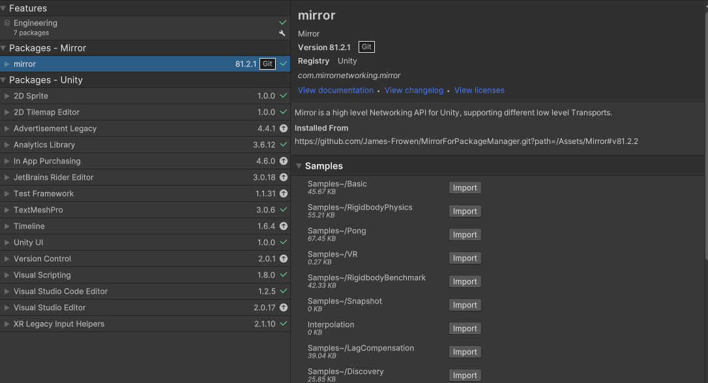

# Mirror for Unity Package Manager

Package manager support for [Mirror](https://github.com/MirrorNetworking/Mirror)

## Install 

**IMPORTANT:** Make sure to include path and commit/tag in the url

### Manifest.json
To add mirror add this to your manifest.json file
```json
"com.mirrornetworking.mirror": "https://github.com/James-Frowen/MirrorForPackageManager.git?path=/Assets/Mirror#v81.2.2",
```

### Package Manager gui
add from url in 
```
https://github.com/James-Frowen/MirrorForPackageManager.git?path=/Assets/Mirror#v81.2.2
```



## Get examples

Examples can be imported by using the package manager gui


